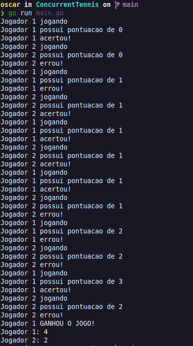

# ConcurrentTennis

#### Discentes:
- ISAAC REINALDO PINHEIRO DE LIMA - 20190043533
- OSCAR KEMUEL ORRICO DOS SANTOS - 20200045420

## Como rodar o programa:
Para rodar é necessário que tenha o Go instalado em sua máquina. Programa desenvolvido na última versão do Go.

~~~javascript
$ git clone https://github.com/isaacrpl7/ConcurrentTennis.git

$ cd ConcurrentTennis

$ go run main.go
~~~

## Resultados

